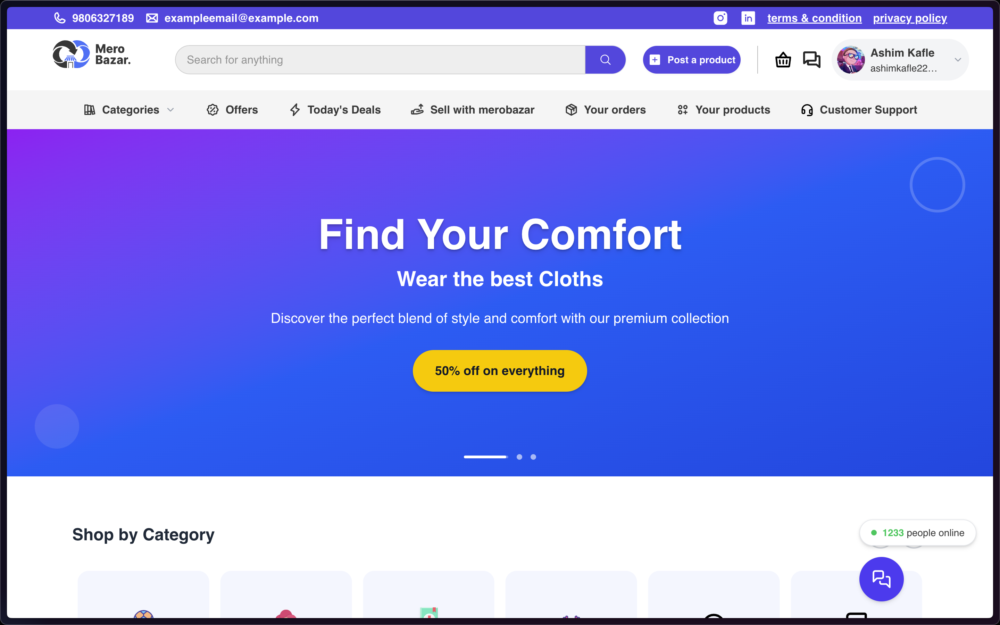
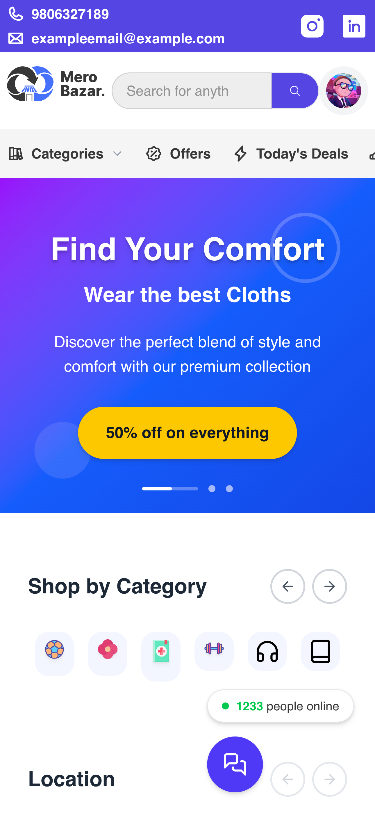

# 🛍️ MeroBazar

## 🚀 Tech Stack

- **Next.js (App Router)** – Framework for server-side rendering and routing.
- **TypeScript** – Strongly typed language for scalable code.
- **Tailwind CSS** – Utility-first CSS framework for efficient styling.
- **ShadCN UI** – Accessible, composable, and customizable UI components.
- **Framer Motion** – Powerful animation library for React.

## ✅ Features

- 🎯 **Pixel-perfect** implementation from Figma design
- 📱 **Responsive** and mobile-first layout
- 🧩 **Reusable** component-based architecture
- 🎨 **Theme-consistent** styling with Tailwind
- 💫 **Smooth animations** using Framer Motion
- 🛠️ **Clean codebase** with TypeScript support

## 📸 Screenshots

> _(Replace the paths below with your actual screenshots)_

| Desktop                                  | Mobile                                |
| ---------------------------------------- | ------------------------------------- |
|  |  |

## 🧪 Getting Started

To run the project locally:

```bash
# 1. Install dependencies
npm install

# 2. Start the development server
npm run dev

# 3. Open in browser
http://localhost:3000

```

## 🗂️ Folder Structure

```vbnet
/app → Pages and layouts (Next.js App Router)
/components → Reusable UI components (ShadCN + custom)
/public → Static assets (images, icons)
/lib → Utilities and constants
```

🔗 Live Links
🚀 Live Demo: https://merobazar.vercel.app
💻 Source Code: https://github.com/bishalmoktan/merobazar
